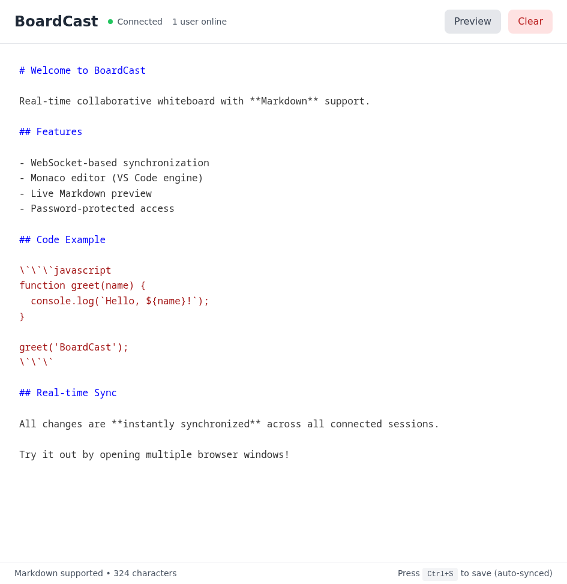

# BoardCast

A modern, real-time collaborative whiteboard application with Markdown support and multi-tab functionality. Perfect for sharing notes, code snippets, and ideas across multiple sessions.


## Features

- **Real-time Sync**: WebSocket-based instant synchronization across all connected sessions
- **Multi-Tab Support**: Create and manage multiple pages/tabs for better organization
- **Markdown Support**: Rich text editing with Markdown formatting and live preview
- **Monaco Editor**: VS Code-powered editor with syntax highlighting
- **Single-User Auth**: Password-protected access for secure collaboration
- **Modern UI**: Clean, responsive interface built with React and TailwindCSS
- **Auto-Reconnect**: Automatic reconnection on connection loss
- **Docker Ready**: Easy deployment with Docker and GHCR

## Screenshots

### Login Screen


### Editor Mode with Multiple Tabs


### Preview Mode


## Quick Start

### Using Docker (Recommended)

```bash
docker run -d -p 8080:8080 \
  ghcr.io/yosebyte/boardcast:latest \
  --password YOUR_PASSWORD
```

Visit `http://localhost:8080` and enter your password.

### Using Docker Compose

```yaml
version: '3.8'
services:
  boardcast:
    image: ghcr.io/yosebyte/boardcast:latest
    ports:
      - "8080:8080"
    command: ["--port", "8080", "--password", "your-secure-password"]
    restart: unless-stopped
```

### From Source

**Prerequisites:**
- Go 1.21+
- Node.js 18+

**Build and run:**

```bash
# Install backend dependencies
go mod download

# Build frontend
cd web
npm install
npm run build
cd ..

# Run server
go run main.go --port 8080 --password your-password
```

## Configuration

### Command-line Options

- `--port` - Server port (default: `8080`)
- `--password` - Authentication password (default: `boardcast`)

### Examples

```bash
# Custom port and password
./boardcast --port 3000 --password mysecret

# Using environment variables
PORT=3000 PASSWORD=mysecret ./boardcast

# Docker with custom settings
docker run -p 3000:3000 ghcr.io/yosebyte/boardcast:latest \
  --port 3000 --password mysecret
```

## Usage

### Getting Started

1. **Login**: Enter the configured password
2. **Edit**: Type or paste content in the editor
3. **Markdown**: Use Markdown syntax for formatting
4. **Preview**: Click "Preview" to see rendered Markdown
5. **Share**: All connected sessions see changes in real-time

### Multi-Tab Management

- **Create Tab**: Click the `+` button in the tab bar
- **Switch Tab**: Click on any tab to switch to it
- **Rename Tab**: Double-click on a tab name to rename it
- **Delete Tab**: Click the `×` button on a tab (requires at least one tab to remain)
- **Clear Tab**: Use the "Clear" button to erase the current tab's content

All tabs sync in real-time across all connected sessions.

### Markdown Examples

```markdown
# Heading 1
## Heading 2

**Bold text** and *italic text*

- List item 1
- List item 2

`code inline`

\`\`\`javascript
// Code block
console.log('Hello, BoardCast!');
\`\`\`
```

## Architecture

- **Backend**: Go + Gorilla WebSocket
- **Frontend**: React + TypeScript + Vite
- **Editor**: Monaco Editor (VS Code engine)
- **Styling**: TailwindCSS
- **Markdown**: react-markdown
- **State Management**: React Hooks

## Security Notes

- Single password authentication
- CORS enabled for development
- WebSocket connections are authenticated
- Use HTTPS in production with a reverse proxy
- No data persistence (in-memory only)

## Development

```bash
# Terminal 1: Run backend
go run main.go --port 8080 --password dev

# Terminal 2: Run frontend dev server
cd web
npm run dev
```

Frontend dev server runs on `http://localhost:5173` with API proxy to backend.

## Building

### Binary

```bash
go build -o boardcast main.go
```

### Docker Image

```bash
docker build -t boardcast:latest .
```

### Multi-platform Docker Image

```bash
docker buildx build --platform linux/amd64,linux/arm64 \
  -t ghcr.io/yosebyte/boardcast:latest \
  --push .
```

## Contributing

Contributions are welcome! Please feel free to submit a Pull Request.

## License

BSD-3-Clause License - see LICENSE file for details

## Changelog

### v1.1.0
- Added multi-tab/page support for better content organization
- Tab management features (create, rename, delete, switch)
- Improved real-time synchronization across tabs
- Enhanced UI with tab bar

### v1.0.0
- Initial release
- Real-time WebSocket synchronization
- Markdown editor with Monaco
- Password-protected access
- Docker multi-platform support
