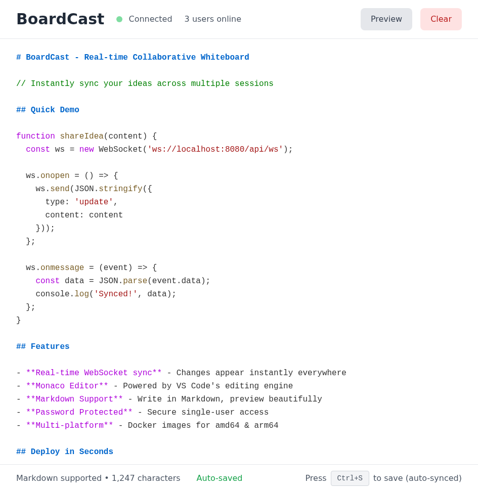
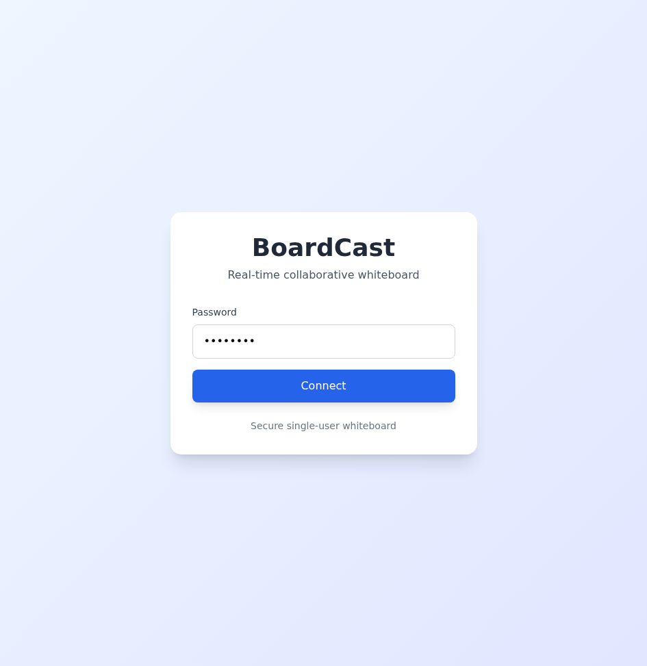
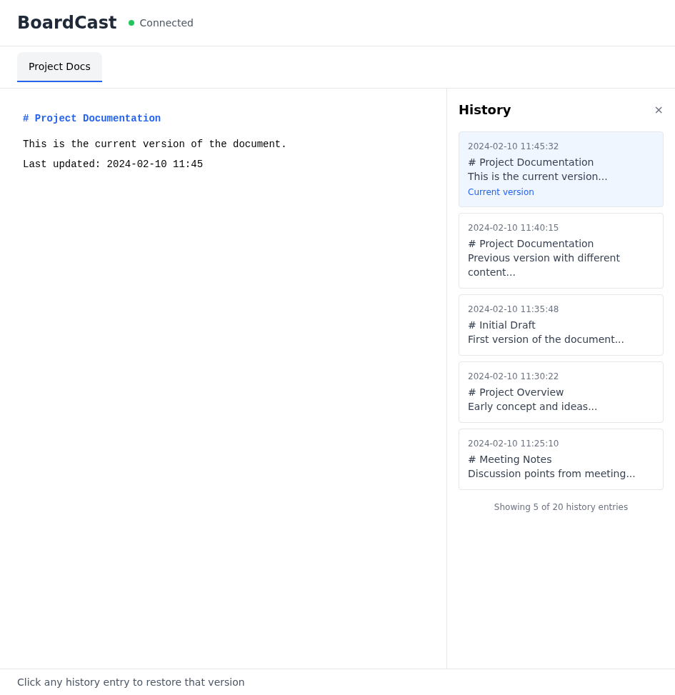
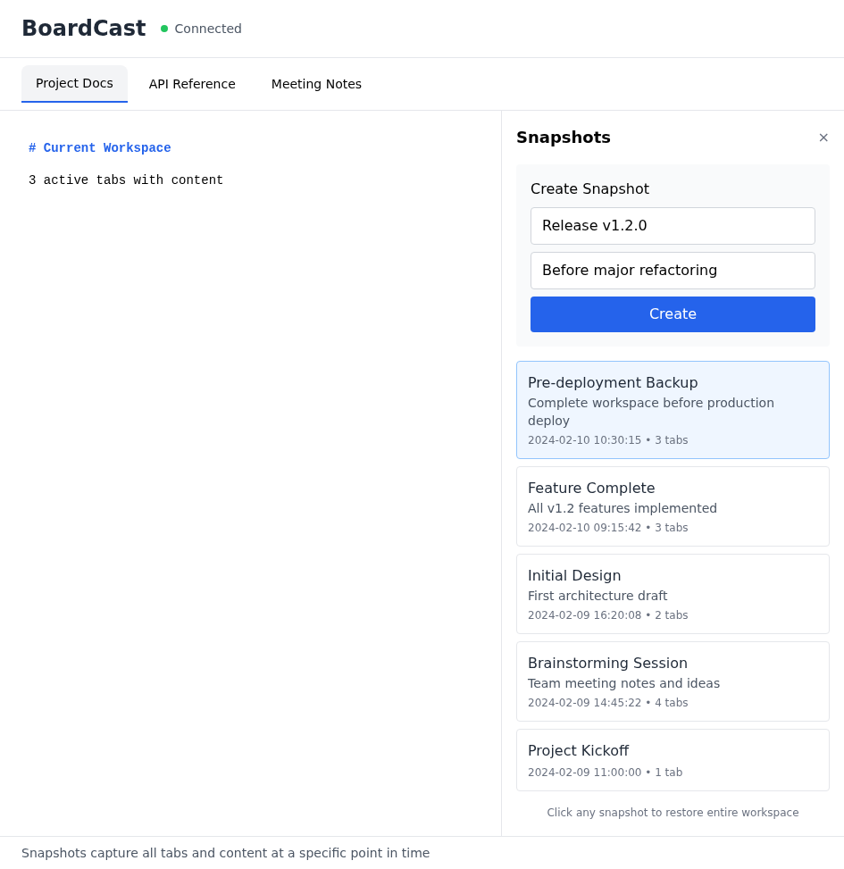

# BoardCast

A modern, real-time collaborative whiteboard application with Markdown support, multi-tab functionality, persistent storage, and rich history tracking. Perfect for teams, documentation, brainstorming, and code sharing.



## Features

### Core Functionality
- **Real-time Sync**: WebSocket-based instant synchronization across all connected sessions
- **Multi-Tab Support**: Create and manage multiple pages/tabs for better organization
- **Markdown Support**: Rich text editing with Markdown formatting and live preview
- **Monaco Editor**: VS Code-powered editor with syntax highlighting

### Security & Authentication
- **Enhanced Password Security**: Support for environment variables and password files
- **JWT Token Authentication**: Session-based authentication with token expiration
- **Secure Configuration**: No password exposure in command-line arguments

### Data Management
- **Persistent Storage**: SQLite database for reliable data persistence
- **History Tracking**: Complete edit history for every tab with 20+ historical versions
- **Snapshot System**: Create named snapshots of all tabs for backup and restore
- **Auto-save**: Automatic history snapshots every 5 minutes

### Media & Images
- **Image Upload**: Drag & drop, paste, or click to upload images
- **Image Storage**: Persistent image storage in database
- **Markdown Integration**: Automatic Markdown image syntax generation
- **Multiple Formats**: Support for JPG, PNG, GIF, WebP

### User Experience
- **Modern UI**: Clean, responsive interface built with React and TailwindCSS
- **Auto-Reconnect**: Automatic reconnection on connection loss
- **Docker Ready**: Easy deployment with Docker and GHCR
- **Multi-platform**: Docker images for amd64 & arm64

## Screenshots

### Login Screen

*Secure password-based authentication with JWT tokens*

### History Tracking

*Browse and restore from complete edit history with timestamps*

### Snapshot Management

*Create named snapshots and restore entire workspace with one click*

### Preview Mode

*Live Markdown preview with rendered formatting*

## Quick Start

### Using Docker (Recommended)

```bash
# Using environment variable (recommended)
docker run -d -p 8080:8080 \
  -e BOARDCAST_PASSWORD=your-secure-password \
  -v boardcast-data:/app/data \
  ghcr.io/yosebyte/boardcast:latest

# Using password file (most secure)
docker run -d -p 8080:8080 \
  -v /path/to/password.txt:/run/secrets/password:ro \
  -v boardcast-data:/app/data \
  ghcr.io/yosebyte/boardcast:latest \
  --password-file /run/secrets/password
```

Visit `http://localhost:8080` and enter your password.

### Using Docker Compose

```yaml
version: '3.8'
services:
  boardcast:
    image: ghcr.io/yosebyte/boardcast:latest
    ports:
      - "8080:8080"
    environment:
      - BOARDCAST_PASSWORD=your-secure-password
    volumes:
      - boardcast-data:/app/data
    restart: unless-stopped

volumes:
  boardcast-data:
```

### From Source

**Prerequisites:**
- Go 1.21+
- Node.js 18+

**Build and run:**

```bash
# Clone repository
git clone https://github.com/yosebyte/boardcast
cd boardcast

# Install backend dependencies
go mod download

# Build frontend
cd web
npm install
npm run build
cd ..

# Run server with environment variable
export BOARDCAST_PASSWORD=your-secure-password
go run ./cmd/boardcast
```

## Configuration

### Password Configuration (Priority Order)

1. **Environment Variable** (Recommended)
   ```bash
   export BOARDCAST_PASSWORD=your-secure-password
   ./boardcast
   ```

2. **Password File** (Most Secure)
   ```bash
   echo "your-secure-password" > /secure/location/password.txt
   chmod 600 /secure/location/password.txt
   ./boardcast --password-file /secure/location/password.txt
   ```

3. **Command-line Flag** (Deprecated - visible in process list)
   ```bash
   ./boardcast --password your-password  # Not recommended
   ```

### Command-line Options

- `--port` - Server port (default: `8080`)
- `--password` - Authentication password (deprecated, use env or file)
- `--password-file` - Path to password file
- `--data-dir` - Data directory for database and uploads (default: `./data`)

### Examples

```bash
# Production deployment with password file
export BOARDCAST_PASSWORD=strong-password
./boardcast --port 8080 --data-dir /var/lib/boardcast

# Docker with custom data directory
docker run -d -p 8080:8080 \
  -e BOARDCAST_PASSWORD=your-password \
  -v /path/to/data:/app/data \
  ghcr.io/yosebyte/boardcast:latest \
  --data-dir /app/data
```

## Usage

### Getting Started

1. **Login**: Enter the configured password
2. **Edit**: Type or paste content in the editor
3. **Markdown**: Use Markdown syntax for formatting
4. **Preview**: Click "Preview" to see rendered Markdown
5. **Share**: All connected sessions see changes in real-time

### Multi-Tab Management

- **Create Tab**: Click the `+` button in the tab bar
- **Switch Tab**: Click on any tab to switch to it
- **Rename Tab**: Double-click on a tab name to rename it
- **Delete Tab**: Click the `×` button on a tab (requires at least one tab to remain)
- **Clear Tab**: Use the "Clear" button to erase the current tab's content

All tabs are automatically saved and synchronized in real-time.

### History & Snapshots

**History**:
- Click "History" to view edit history for the current tab
- Browse up to 20 historical versions
- Click any history entry to restore it
- Auto-saves history every 5 minutes

**Snapshots**:
- Click "Snapshots" to manage full workspace snapshots
- Create named snapshots with optional descriptions
- Restore entire workspace from any snapshot
- Snapshots include all tabs and their content

### Image Upload

Three ways to add images:

1. **Drag & Drop**: Drag an image file anywhere in the editor
2. **Paste**: Copy an image and paste (Ctrl+V / Cmd+V) in the editor
3. **Upload Button**: Click "Upload Image" button to select a file

Images are automatically:
- Stored in the database
- Converted to Markdown syntax
- Displayed in preview mode

### Markdown Examples

```markdown
# Heading 1
## Heading 2

**Bold text** and *italic text*

- List item 1
- List item 2

`code inline`

\`\`\`javascript
// Code block
console.log('Hello, BoardCast!');
\`\`\`


```

## Architecture

### Backend
- **Language**: Go 1.21
- **WebSocket**: Gorilla WebSocket
- **Authentication**: JWT tokens with expiration
- **Database**: SQLite (modernc.org/sqlite)
- **Storage**: Persistent file-based database

### Frontend
- **Framework**: React 18 + TypeScript
- **Build Tool**: Vite
- **Editor**: Monaco Editor (VS Code engine)
- **Styling**: TailwindCSS
- **Markdown**: react-markdown
- **State Management**: React Hooks

### Data Structure
```
data/
├── boardcast.db        # SQLite database
└── (images stored in database as BLOBs)
```

## Security Best Practices

1. **Password Configuration**:
   - Use environment variables in production
   - Use password files for Docker secrets
   - Avoid command-line password flags

2. **HTTPS**:
   - Use a reverse proxy (nginx, Caddy, Traefik) for HTTPS
   - Enable SSL/TLS termination at the proxy level

3. **Data Persistence**:
   - Use Docker volumes for data persistence
   - Regular backups of the data directory
   - Snapshot system for workspace backups

4. **Network Security**:
   - Run behind firewall or VPN for private deployments
   - Use strong, unique passwords
   - Consider IP whitelisting for sensitive deployments

## Development

### Project Structure

```
boardcast/
├── cmd/
│   └── boardcast/         # Application entry point
│       ├── main.go        # Server, routing, WebSocket
│       └── storage.go     # SQLite database layer
├── web/
│   ├── src/
│   │   ├── App.tsx        # React main component
│   │   ├── main.tsx       # Entry point
│   │   └── index.css      # Tailwind styles
│   ├── public/            # Static assets
│   ├── package.json       # Node dependencies
│   └── vite.config.ts     # Build configuration
├── docs/
│   ├── demo.png           # Main demo screenshot
│   ├── screenshot-*.png   # Feature screenshots
│   └── README.md          # Screenshots metadata
├── .github/
│   └── workflows/
│       └── release.yml    # CI/CD pipeline
├── go.mod                 # Go dependencies
├── go.sum                 # Go dependency checksums
├── Dockerfile             # Multi-stage build
├── LICENSE                # BSD-3-Clause
└── README.md              # This file
```

### Local Development

```bash
# Terminal 1: Run backend with hot reload
export BOARDCAST_PASSWORD=dev
go run ./cmd/boardcast --data-dir ./dev-data

# Terminal 2: Run frontend dev server
cd web
npm run dev
```

Frontend dev server runs on `http://localhost:5173` with API proxy to backend.

### Building from Source

```bash
# Build backend binary
go build -o boardcast ./cmd/boardcast

# Build frontend
cd web
npm install
npm run build
```

### Docker Build

```bash
# Local build
docker build -t boardcast:latest .

# Multi-platform build
docker buildx build --platform linux/amd64,linux/arm64 \
  -t ghcr.io/yosebyte/boardcast:latest \
  --push .
```

## Troubleshooting

### Database Locked Error
If you see "database is locked" errors:
```bash
# Check for zombie processes
ps aux | grep boardcast

# Ensure only one instance is running
# Stop all instances and restart
```

### Image Upload Fails
- Check data directory permissions
- Ensure database is writable
- Verify disk space availability

### Connection Issues
- Check WebSocket connection in browser console
- Verify firewall rules allow WebSocket connections
- Check if reverse proxy is configured correctly for WebSocket upgrade

## Contributing

Contributions are welcome! Please feel free to submit a Pull Request.

## License

BSD-3-Clause License - see LICENSE file for details
