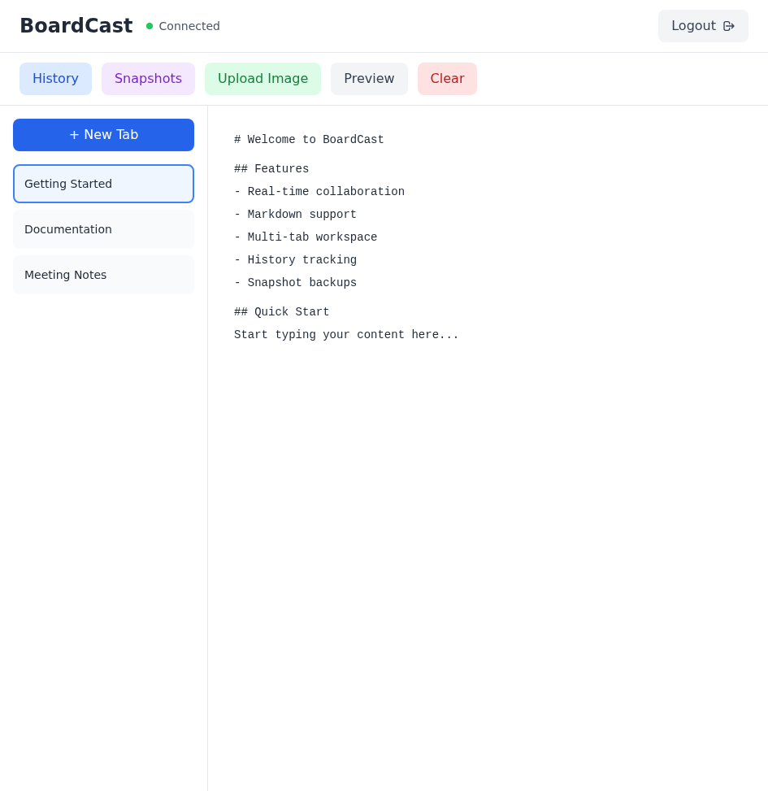

# BoardCast

A modern, real-time collaborative Markdown whiteboard with split-view editing. Built for teams, documentation, and content collaboration.

## Features

### Editor
- **VS Code Monaco Editor**: Professional code editor with syntax highlighting
- **Split View**: Side-by-side raw markdown and rendered preview
- **Real-time Sync**: WebSocket-based instant synchronization across all sessions
- **Multi-Tab Support**: Organize content with multiple tabs
- **Smooth Performance**: Debounced updates for lag-free typing

### Markdown
- **GitHub Flavored Markdown**: Full GFM support with remark-gfm
- **Beautiful Rendering**: Tailwind Typography for professional styling
- **Live Preview**: See changes instantly in the preview pane
- **Formatting Support**: Headers, lists, code blocks, tables, and more

### Security
- **Session Cookie Authentication**: HTTP-only cookies for secure sessions
- **Environment Variables**: Password via `BOARDCAST_PASSWORD`
- **Password Files**: Read from secure file paths
- **Auto-Expiry**: 24-hour session timeout
- **No Command-line Exposure**: Passwords never in process lists

### Storage
- **SQLite Database**: Persistent storage for all content
- **Multi-Tab Persistence**: All tabs saved automatically
- **Data Volume**: Docker volume support for data portability
- **Auto-Save**: Content synced every 500ms (debounced)

## Screenshots

### Split View Editor

*VS Code-style split view: Raw markdown editor on the left, rendered preview on the right*

### Login

*Secure authentication with session cookies*

### Preview

*Beautiful markdown rendering with Tailwind Typography*

## Quick Start

### Docker (Recommended)

```bash
docker run -d -p 8080:8080 \
  -e BOARDCAST_PASSWORD=your-secure-password \
  -v boardcast-data:/app/data \
  ghcr.io/yosebyte/boardcast:latest
```

Visit `http://localhost:8080` and enter your password.

### Docker Compose

```yaml
version: '3.8'
services:
  boardcast:
    image: ghcr.io/yosebyte/boardcast:latest
    ports:
      - "8080:8080"
    environment:
      - BOARDCAST_PASSWORD=your-secure-password
    volumes:
      - boardcast-data:/app/data
    restart: unless-stopped

volumes:
  boardcast-data:
```

## Configuration

### Password Options

**Environment Variable (Recommended):**
```bash
docker run -d -p 8080:8080 \
  -e BOARDCAST_PASSWORD=mysecretpass \
  -v boardcast-data:/app/data \
  ghcr.io/yosebyte/boardcast:latest
```

**Password File (Most Secure):**
```bash
echo "mysecretpass" > /path/to/password.txt
docker run -d -p 8080:8080 \
  -v /path/to/password.txt:/run/secrets/password:ro \
  -v boardcast-data:/app/data \
  ghcr.io/yosebyte/boardcast:latest \
  --password-file /run/secrets/password
```

### Data Directory

Default: `/app/data`

Change with `--data-dir`:
```bash
docker run -d -p 8080:8080 \
  -e BOARDCAST_PASSWORD=pass \
  -v boardcast-data:/custom/path \
  ghcr.io/yosebyte/boardcast:latest \
  --data-dir /custom/path
```

## Usage

### Tabs
- **Create**: Click "+ New Tab" button
- **Rename**: Hover over tab, click edit icon, enter new name
- **Delete**: Hover over tab, click X icon
- **Switch**: Click on any tab to switch

### Preview
- **Toggle**: Click "Show/Hide Preview" button in top right
- **Split View**: See raw markdown and rendered output side-by-side
- **Full Width**: Hide preview to use full width for editing

### Markdown
Supports GitHub Flavored Markdown (GFM):
- Headers: `# H1`, `## H2`, etc.
- **Bold**: `**text**`
- *Italic*: `*text*`
- Lists: `-` or `1.`
- Code: `` `inline` `` or ` ```block``` `
- Links: `[text](url)`
- Images: ``
- Tables: `| col | col |`
- Task lists: `- [ ]` and `- [x]`

## Development

### Prerequisites
- Go 1.21+
- Node.js 18+
- npm or yarn

### Build from Source

```bash
# Clone repository
git clone https://github.com/yosebyte/boardcast.git
cd boardcast

# Build frontend
cd web
npm install
npm run build

# Build backend
cd ..
go build -o boardcast ./cmd/boardcast

# Run
./boardcast --password=mypass --data-dir=./data
```

### Development Mode

```bash
# Terminal 1: Backend
go run ./cmd/boardcast --password=dev --data-dir=./dev-data

# Terminal 2: Frontend
cd web
npm run dev
```

## Architecture

```
boardcast/
├── cmd/
│   └── boardcast/
│       ├── main.go      # HTTP server, WebSocket, auth
│       └── storage.go   # SQLite database layer
├── web/
│   ├── src/
│   │   └── App.tsx      # React UI with Monaco Editor
│   ├── package.json
│   └── vite.config.ts
├── Dockerfile           # Multi-stage, multi-platform build
└── go.mod
```

## Technology Stack

- **Backend**: Go 1.21, Gorilla WebSocket, SQLite (modernc.org)
- **Frontend**: React 18, TypeScript, Monaco Editor, ReactMarkdown
- **Styling**: TailwindCSS 3, Tailwind Typography
- **Build**: Vite (frontend), Docker multi-stage (both)
- **Markdown**: remark-gfm for GitHub Flavored Markdown

## Security Best Practices

1. **Use Environment Variables**: Never pass passwords via command line
2. **Use Password Files**: Even better, read from a secure file
3. **HTTPs**: Use a reverse proxy (nginx, Caddy) with SSL in production
4. **Firewall**: Restrict access to port 8080
5. **Backups**: Regularly backup the data volume
6. **Updates**: Keep Docker images up to date

## Performance

- **Debounced Updates**: 500ms delay reduces WebSocket traffic
- **Immediate UI**: Local state updates for smooth typing
- **Optimized Rendering**: Only re-render changed components
- **Persistent Connection**: Auto-reconnect on network issues

## Troubleshooting

### Cannot Connect
- Check if server is running: `docker ps`
- Check logs: `docker logs boardcast`
- Verify password is correct

### Data Not Persisting
- Ensure volume is mounted: `docker inspect boardcast | grep Mounts`
- Check data directory permissions
- Verify SQLite database exists in volume

### Connection Keeps Dropping
- Check network stability
- Verify firewall isn't blocking WebSocket
- Check server logs for errors

## License

BSD 3-Clause License

Copyright (c) 2026, Mikyla

## Links

- **GitHub**: https://github.com/yosebyte/boardcast
- **Docker**: https://github.com/yosebyte/boardcast/pkgs/container/boardcast
- **Issues**: https://github.com/yosebyte/boardcast/issues
