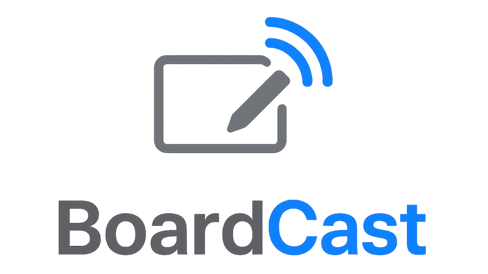
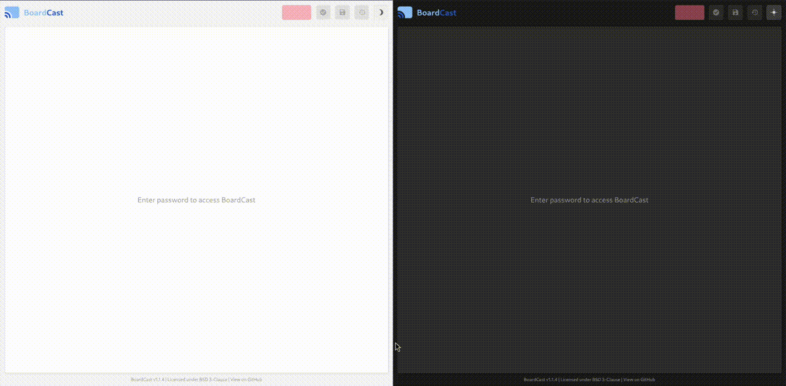

<div align="center">
  
</div>

<div align="center">
  <p><strong>Lightweight and Minimalist Real-Time Collaborative Text Whiteboard</strong></p>
</div>

## 📖 Overview

BoardCast is a lightweight real-time collaborative whiteboard application developed in Go. It allows multiple users to authenticate via password and collaborate on editing text content in real-time on the same whiteboard. The application features a clean user interface, supports WebSocket real-time synchronization, and includes a built-in snapshot feature for saving and restoring content at any time, making it an ideal tool for team collaboration, meeting notes, and brainstorming.

## 🎬 Demo

<div align="center">
  
</div>

## ✨ Features

### 🔐 Secure Authentication
- Password-based access control
- Session management with secure cookie storage
- bcrypt password encryption
- Optional random password generation

### 🔄 Real-Time Collaboration
- WebSocket real-time communication
- Multi-user synchronized editing
- Automatic reconnection on disconnection
- Automatic content saving and restoration

### 📸 Snapshot Management
- One-click saving of whiteboard content snapshots
- Quick restoration of historical snapshots
- Local file persistent storage
- Support for overwriting updates

### 📱 Responsive Design
- Adapted for desktop and mobile devices
- Clean and intuitive user interface
- Modern design style
- Support for dark theme

### 🚀 Lightweight and Efficient
- Single-file deployment
- Out-of-the-box usage
- Low resource consumption
- No database dependency

### 🛠️ Operations-Friendly
- Docker containerization support
- Multi-platform binary releases
- Graceful shutdown and error handling
- Structured logging

## 📦 Installation

### 📋 Binary Releases

Download the pre-compiled binary files suitable for your system from the [GitHub Releases](https://github.com/yosebyte/boardcast/releases) page.

📱 **Supported Platforms**:
- **🐧 Linux**: amd64, arm64, arm, 386, mips, etc.
- **🪟 Windows**: amd64, arm64, 386
- **🍎 macOS**: amd64, arm64 (Apple Silicon)
- **🔥 FreeBSD**: amd64, arm64

### 🔧 Compile from Source

```bash
# Clone the repository
git clone https://github.com/yosebyte/boardcast.git
cd boardcast

# Compile
go mod download
go build -o boardcast ./cmd/boardcast

# Run
./boardcast --password "your-secure-password"
```

### 🐳 Docker Image

```bash
# Pull from GitHub Container Registry
docker pull ghcr.io/yosebyte/boardcast:latest

# Or build yourself
docker build -t boardcast .
```

### 📝 Usage Guide

1. **🌐 Access the Application**: Open the application address in your browser
2. **🔑 Authentication**: Enter the password in the password field to log in
3. **✏️ Start Collaborating**: Input and edit text content in the whiteboard area
4. **💾 Save Snapshot**: Click the save button to save the current content to a local file
5. **🔄 Restore Snapshot**: Click the restore button to restore content from the snapshot file
6. **🎨 Theme Toggle**: Click the toggle button to switch between light and dark themes
7. **🚪 Disconnect**: Click the exit button to log out and disconnect

**📊 Connection Status Indicators**:
- **🔴 Red Password Field**: Disconnected state, requires password input for authentication
- **🟡 Yellow Password Field**: Connecting state, establishing WebSocket connection
- **🟢 Green Password Field**: Connected state, normal real-time collaboration possible

**📸 Snapshot Feature Notes**:
- Snapshot files are saved as `boardcast.txt` in the application run directory
- Saving a snapshot overwrites the previous snapshot file
- Restoring a snapshot synchronizes the content to all online users

## ⚙️ Configuration

### 🚀 Command Line Arguments

```bash
./boardcast [options]
```

**📝 Available Options:**

| Parameter | Type | Default | Description |
|-----------|------|---------|-------------|
| `--password` | string | Randomly generated | 🔐 Access password |
| `--port` | string | `8200` | 🌐 Server listening port |
| `--version` | bool | `false` | ℹ️ Display version information and exit |

**💡 Examples:**

```bash
# Use random password
./boardcast

# Custom password and port
./boardcast --password "secret" --port 3000

# View version
./boardcast --version
```

## 🛠️ Development

### 📁 Project Structure

```
boardcast/
├── cmd/boardcast/         # Application entry point
│   └── main.go            # Main function
├── internal/              # Internal packages
│   ├── server.go          # HTTP server
│   ├── auth/              # Authentication module
│   │   └── auth.go        # Authentication manager
│   ├── config/            # Configuration management
│   │   └── config.go      # Configuration parsing and validation
│   ├── handler/           # HTTP handlers
│   │   └── handlers.go    # Route handling functions
│   ├── template/          # HTML templates
│   │   └── whiteboard.go  # Whiteboard interface template
│   └── websocket/         # WebSocket management
│       └── hub.go         # WebSocket connection manager
├── .github/workflows/     # GitHub Actions workflows
│   ├── docker.yml         # Docker image build workflow
│   └── release.yml        # Binary release workflow
├── Dockerfile             # Docker build file
├── .goreleaser.yml        # GoReleaser configuration
├── go.mod                 # Go module definition
├── go.sum                 # Go module checksums
└── README.md              # Project documentation
```

### 🧩 Core Components

#### 1. 🌐 Server (`internal/server.go`)
- HTTP server configuration and lifecycle management
- Route registration and middleware
- Graceful shutdown handling

#### 2. 🔐 Authentication (`internal/auth/`)
- bcrypt-based password verification
- Session management
- Authentication middleware

#### 3. 🔌 WebSocket Management (`internal/websocket/`)
- Client connection management
- Real-time message broadcasting
- Content synchronization
- Snapshot saving and restoration features

#### 4. 🎯 Handlers (`internal/handler/`)
- HTTP route handling
- Request validation and responses
- Static file serving
- Snapshot API endpoint handling

### 🛠️ Tech Stack

- **🐹 Backend**: Go 1.25+
- **🔌 WebSocket**: Gorilla WebSocket
- **🔐 Authentication**: Gorilla Sessions + bcrypt
- **🎨 Frontend**: Native HTML/CSS/JavaScript
- **🐳 Containerization**: Docker + multi-stage builds
- **🔄 CI/CD**: GitHub Actions

### 💻 Development Environment Setup

```bash
# 1. Clone the repository
git clone https://github.com/yosebyte/boardcast.git
cd boardcast

# 2. Install dependencies
go mod download

# 3. Run development server
go run cmd/boardcast/main.go --password "dev-password"

# 4. Access the application
open http://localhost:8200
```

### 🔨 Building

```bash
# Local build
go build -o boardcast ./cmd/boardcast

# Cross-compile (Linux)
GOOS=linux GOARCH=amd64 go build -o boardcast-linux-amd64 ./cmd/boardcast

# Docker build
docker build -t boardcast .
```

## 🌐 API Endpoints

| Path | Method | Description | Auth Required |
|------|--------|-------------|---------------|
| `/` | GET | 🏠 Whiteboard main page | No |
| `/auth` | POST | 🔐 User authentication | No |
| `/logout` | POST | 🚪 User logout | Yes |
| `/ws` | WebSocket | 🔌 WebSocket connection | Yes |
| `/content` | GET | 📄 Get current content | Yes |
| `/save` | POST | 💾 Save content snapshot | Yes |
| `/restore` | POST | 🔄 Restore content snapshot | Yes |

## 📄 License

This project uses the [BSD 3-Clause License](LICENSE) license
